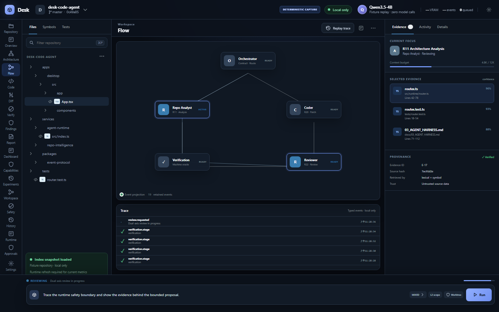
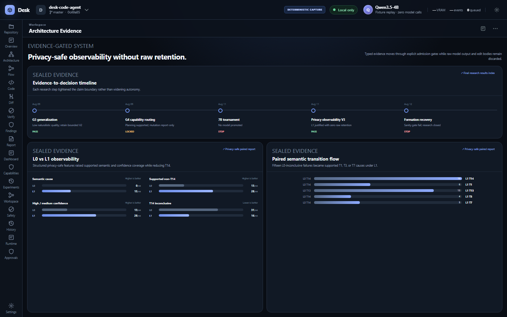
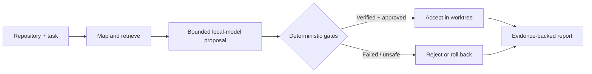
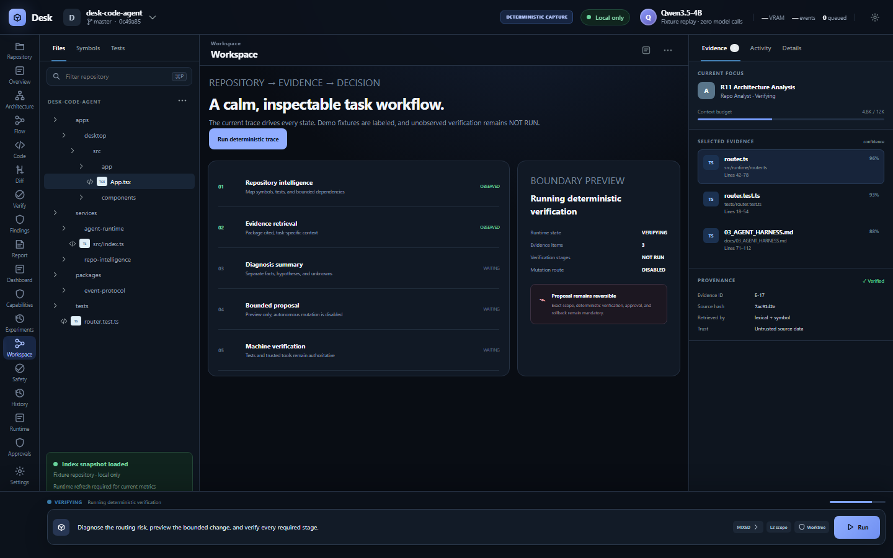
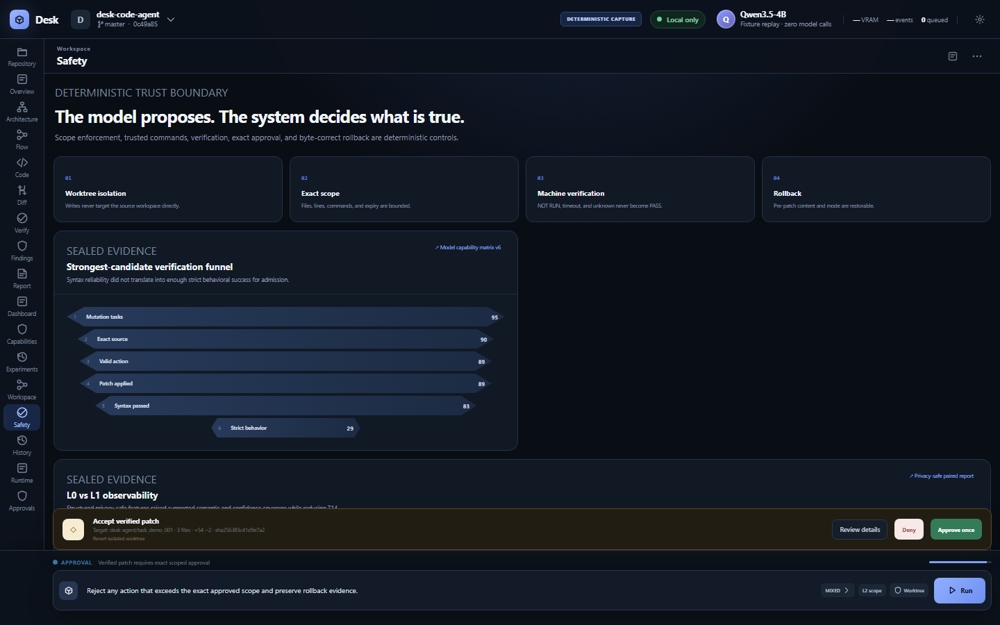
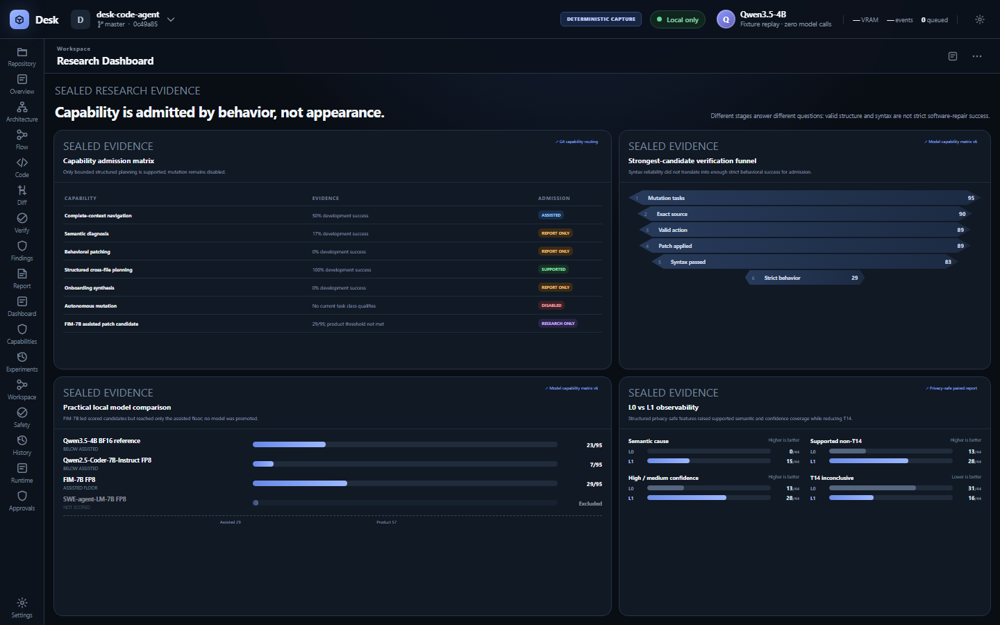

# Desk Code Agent

> **A local-first, verification-first software engineering workbench for small language models.**

<p align="center">
  
</p>

## What Desk Code Agent is

Desk Code Agent turns a repository into an inspectable engineering workspace. It maps code, retrieves cited evidence, bounds model proposals, delegates truth to deterministic verification, and keeps rejection and rollback visible. It is neither a Codex replacement nor a fully autonomous coding system.

## Why it exists

Small local models can be useful engineering components, but fluent output is not proof of a correct repair. Desk Code Agent surrounds one shared local model with repository intelligence, typed state, constrained tools, machine oracles, exact approvals, and an evidence-backed UI. Capabilities enter the product only when measured task behavior supports them.

## Key capabilities

- Local repository acquisition, mapping, symbol search, dependency evidence, and cited retrieval
- Immutable task contracts, feasibility routing, scoped tools, and replayable typed events
- Evidence-backed analysis with explicit facts, hypotheses, confidence, and unknowns
- Worktree isolation, deterministic verification, exact approval, and byte-correct rollback
- Research dashboards with read-only access to canonical bundled artifacts
- Evidence-gated states: Production, Assisted, Research Only, and Disabled

## Architecture

One shared local model sits behind repository intelligence, bounded context packaging, a permissioned tool boundary, deterministic verification, exact approval, and append-only event/artifact storage. Logical roles do not duplicate model weights.



- [Product architecture overview](docs/architecture/PRODUCT_ARCHITECTURE.md)
- [End-to-end architecture](docs/architecture/diagrams/end-to-end-product-architecture.mmd)
- [Evidence-gated admission](docs/architecture/diagrams/evidence-gated-capability-admission.mmd)
- [Privacy-safe observability](docs/architecture/diagrams/privacy-safe-observability.mmd)

## Product workflow



The desktop renders typed runtime and artifact state. Model prose cannot fabricate tool execution or turn `NOT_RUN`, timeout, cancellation, or unknown into `PASS`.



## Verification and safety

- Repository content and tool output are untrusted data, never authority.
- Tools are allowlisted, path-bounded, timed, and executed outside the UI thread.
- Writes use isolated worktrees; protected actions require exact scoped approval.
- Tests, compilers, linters, and verification artifacts—not model narration—control PASS.
- Failed or denied work remains inspectable and reversible.



The short [verification and rollback flow](docs/media/gifs/03-verification-rollback.gif) shows exact review, denial, and reversible final state without implying that autonomous mutation is enabled.

## Research findings

| Finding | Sealed result | Product consequence |
|---|---:|---|
| Structured cross-file planning | 12/12 development tasks | Production-supported only inside its read-only machine-checkable boundary |
| Complete-context navigation | 6/12 | Assisted; user verification required |
| Strongest scored 7B candidate | 29/95 strict behavior | Assisted floor only; no model promotion |
| Bounded retry | 29/95 → 30/95 | No default retry admission |
| Privacy-safe semantic coverage | 0/44 L0 → 15/44 L1 | Research instrumentation justified |
| Raw model outputs / edit bodies retained | 0 / 0 | Privacy gate passed |
| Final formation-recovery primary calls | 0 | Formation effect remains inconclusive |

Capability research is frozen at `RESEARCH_COMPLETE_INCONCLUSIVE_FORMATION_RESULT`.



## Benchmarks

The project distinguishes five outcome levels:

1. **Valid action** — the response matches the constrained action contract.
2. **Syntax validity** — the proposed or resulting source parses or type-checks at that stage.
3. **Visible behavioral verification** — declared visible behavior passes executable checks.
4. **Hidden verification** — held-out behavior passes without exposing the oracle to the model.
5. **Strict success** — every required retrieval, action, safety, syntax, visible/hidden behavior, and rollback gate passes.

Syntax-valid output is not described as successful software repair. FIM measurements use a practical FP8 7B serving configuration and are not a pure model-scale comparison. Mutation findings remain research-only, denominators do not transfer across task populations, bounded retry was not admitted, and the code-formation branch is inconclusive. See [BENCHMARKS.md](BENCHMARKS.md) for sources and qualifiers.

## Capability boundaries

| Capability | State | Current boundary |
|---|---|---|
| Repository navigation | Assisted | Measured support; user verification required |
| Repository explanation | Assisted | Evidence-backed analysis with explicit unknowns |
| Retrieval and evidence | Production | Deterministic indexing, bounded retrieval, and citations |
| Diagnosis | Disabled | Report-only; insufficient reliability for product admission |
| Task planning | Production | Structured cross-file planning in a read-only machine-checkable boundary |
| Patch preview / suggestion | Research Only | Candidate actions remain experimental and non-authoritative |
| Bounded mutation | Disabled | No task class/model passed promotion |
| Retry | Disabled | One recovery in 66 failures did not justify admission |
| Autonomous mutation | Disabled | Reliability threshold not crossed |
| Safety verification | Production | Deterministic policy, command, test, and approval gates |
| Rollback | Production | Exact pre-patch snapshot restoration |
| Semantic observability | Research Only | Privacy-safe L1 instrumentation justified, not a coding capability |

Autonomous mutation remains disabled because it has not crossed the preregistered reliability threshold. The durable state is `KEEP_MUTATION_DISABLED`.

## Privacy

Normal startup does not automatically launch a model. Repository contents remain local; bounded evidence is retrieved per task. Privacy-safe L1 instrumentation retained zero raw model outputs and zero raw edit bodies. The Windows installers contain no model weights, local repositories, benchmark corpora, credentials, or development caches.

## Local hardware and runtime requirements

Development uses Node 24.x, npm, Rust 1.97.1 MSVC, and the Tauri toolchain. The installed Windows desktop does not require Node, Rust, or Visual Studio to launch. It expects Windows WebView2. The local inference runtime and model weights are configured separately and are not bundled.

```bash
npm install
npm run dev
npm run check
```

The local development UI is served at `http://127.0.0.1:4173`.

## Windows install status

Version `0.1.0` provides validated x64 MSI and NSIS installers through [GitHub Releases](https://github.com/hanklin9188/Desk-Code-Agent/releases/tag/v0.1.0). Build, install, installed-path startup, WebView2, 18/18 product surfaces, resource paths, uninstall, and reinstall pass. The v0.1.0 Windows packages are unsigned; Windows may display its normal publisher/reputation warning.

The local model runtime and weights are configured separately and are not bundled. End users do not need Node, Rust, or Visual Studio; WebView2 is expected from a supported Windows environment.

Package identities and checksums are recorded in [the W3 report](docs/validation/WINDOWS_PACKAGING_RELEASE_QA_REPORT.v1.json). Installer binaries are not stored in Git source history.

## Documentation

1. [Current capability status](docs/productization/CAPABILITY_STATUS.md)
2. [Benchmarks and research findings](BENCHMARKS.md)
3. [Architecture overview](docs/architecture/PRODUCT_ARCHITECTURE.md)
4. [Visualization system](docs/productization/VISUALIZATION_DASHBOARD.md)
5. [Demo and media index](docs/media/README.md)
6. [v0.1.0 release notes](docs/releases/v0.1.0.md)
7. [Third-party notices](THIRD_PARTY_NOTICES.md)
8. [Documentation index](docs/README.md)

## Known limitations

- Autonomous mutation and default retry are disabled.
- Model/runtime installation is separate from the desktop installer.
- Human-observed Narrator spoken-output validation is deferred; no accessibility certification is claimed.
- Windows v0.1.0 installers are unsigned; trusted code signing is future hardening.

## Roadmap

Project implementation, portfolio media, local Windows release QA, Apache-2.0 licensing, and v0.1.0 publication are complete. Capability research remains closed and mutation remains disabled. Optional future maintenance includes trusted Windows signing and human Narrator spoken-output validation; neither creates a new engineering phase.

Canonical GitHub target: `https://github.com/hanklin9188/Desk-Code-Agent`.

## License

Desk Code Agent is licensed under the [Apache License 2.0](LICENSE). Third-party dependency terms and pinned notices are recorded in [THIRD_PARTY_NOTICES.md](THIRD_PARTY_NOTICES.md).
