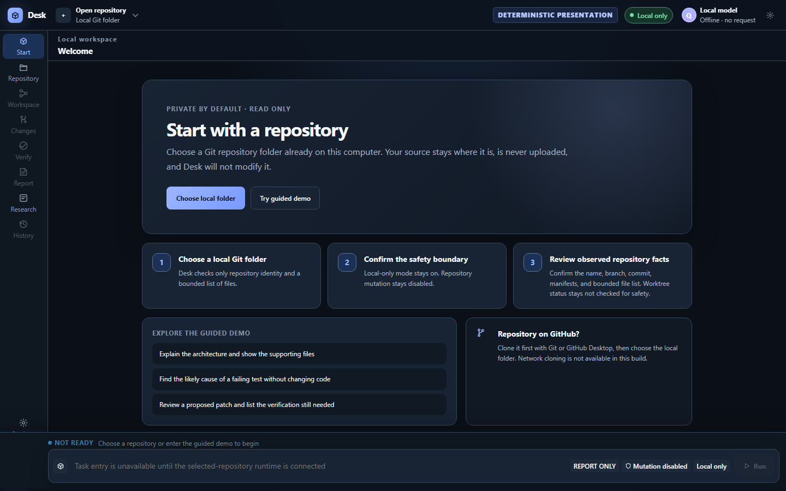
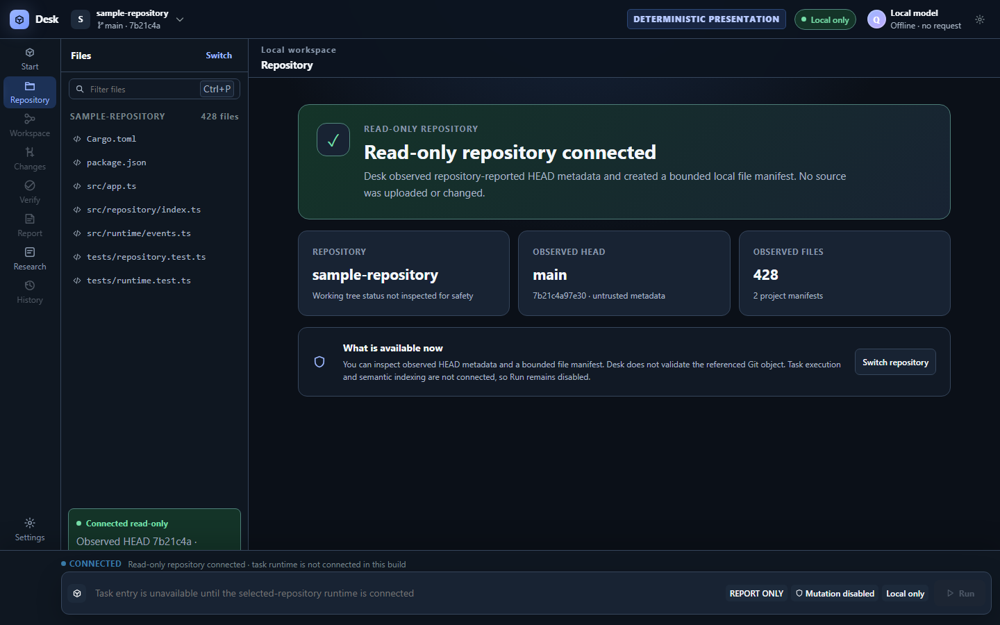
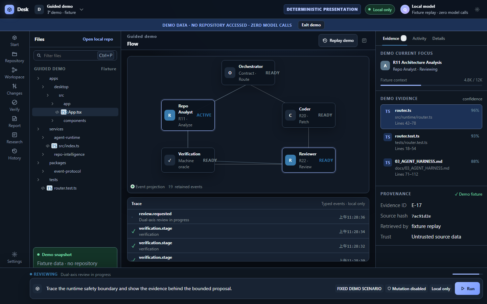
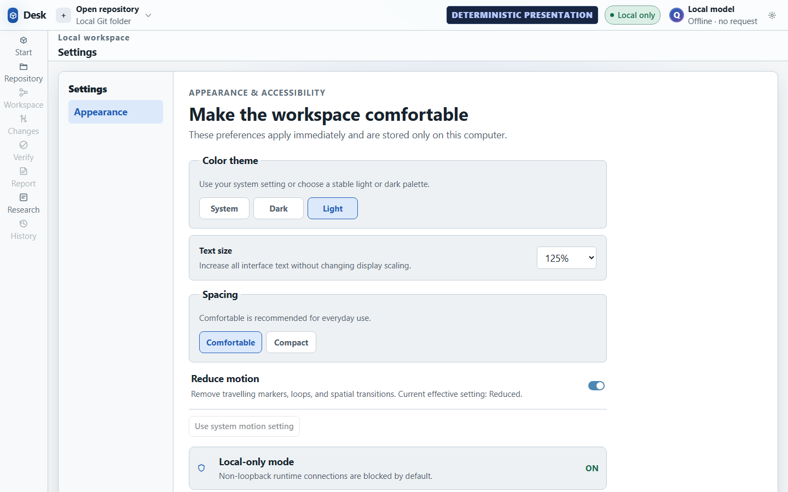
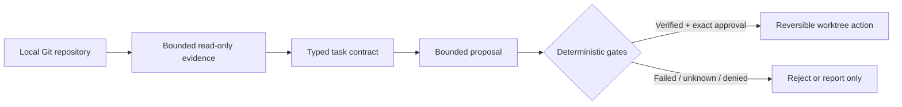
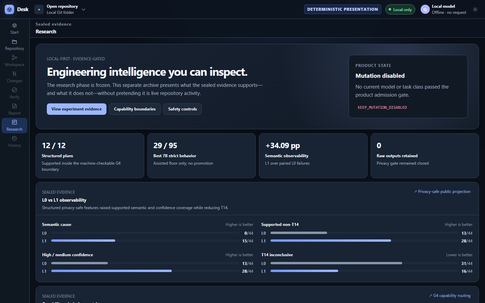

<div align="center">

# Desk Code Agent

### A local-first desktop workspace that makes repository evidence, agent activity, and deterministic verification inspectable.

[](https://github.com/hanklin9188/Desk-Code-Agent/releases/tag/v0.1.0)


[](LICENSE)


**[Download current v0.1.0](https://github.com/hanklin9188/Desk-Code-Agent/releases/tag/v0.1.0)** · **[Preview v0.2.0 quick start](docs/productization/DESKTOP_QUICK_START.md)** · **[繁中快速上手](docs/productization/DESKTOP_QUICK_START.zh-TW.md)** · **[Architecture](docs/architecture/PRODUCT_ARCHITECTURE.md)**

</div>



Desk Code Agent is a calm, inspectable engineering workbench—not a generic chat box and not an autonomous coding system. It keeps repository facts, fixture data, model activity, proposed changes, and machine verification visibly separate.

## Start in three steps

> **Release status:** The screenshots and instructions below describe the
> v0.2.0 release candidate on this branch. The current public v0.1.0 download
> still contains the previous interface; the project will not present it as
> the redesigned build.

1. **Install Desk Code Agent.** Use the v0.2.0 package after its reviewed release is published; [v0.1.0](https://github.com/hanklin9188/Desk-Code-Agent/releases/tag/v0.1.0) is the current previous-interface build.
2. **Choose an existing local Git folder.** Your source stays where it is; Desk does not upload, copy, or modify it.
3. **Check the observed facts.** Desk shows the repository name, repository-reported branch and HEAD text, project manifests, and a bounded file list. HEAD text remains untrusted metadata; working-tree cleanliness is deliberately not inspected because repository-controlled filters are untrusted.

> **Repository only on GitHub?** Clone it first with Git or GitHub Desktop, then choose the local folder. URL cloning is not available in this build. Repository inspection itself starts no Git process and has no Git installation requirement.



The repository check starts no Git process. It reads only bounded, repository-reported `.git/HEAD` and ref text plus a bounded filesystem manifest, skipping symlinks and fixed generated directories. HEAD metadata is untrusted and the referenced Git object is not validated. It makes no model call, application-initiated network request, checkout, hook, lock, content comparison, or source edit, and the UI does not expose the absolute local path. The connected card states `Working tree status not inspected for safety` rather than claiming clean or dirty. Linked worktrees and submodule checkouts are intentionally unsupported in this release candidate; choose the primary checkout.

## What works today

| Available now | Intentionally not connected |
|---|---|
| Native local-folder picker | GitHub URL cloning |
| Read-only observation of HEAD/ref text and a bounded file manifest | Semantic indexing for a desktop-selected repository |
| Explicit guided demo with typed events and cited fixture evidence | Task execution against a desktop-selected repository |
| System, Dark, and Light themes | Bundled model runtime or model weights |
| 100%, 110%, and 125% text size; density and reduced-motion controls | Autonomous mutation or default retry |
| Read-only sealed research archive | Any claim that `NOT_RUN`, timeout, or unknown means PASS |

**Run remains disabled for a selected repository until the real task/index bridge is connected.** Desk does not replay sample activity and present it as work performed on your code.

## A workspace, not a chat box



The optional guided demo is a deterministic product tour:

- **Evidence stays cited.** File, range, confidence, source hash, and trust remain visible.
- **Activity stays typed.** The UI projects replayable runtime events instead of guessing state from model prose.
- **Verification stays authoritative.** Tests, type checks, policy gates, approval, and rollback control the result.

Every demo surface is labelled `DEMO DATA · NO REPOSITORY ACCESSED · ZERO MODEL CALLS`. Exit the demo at any time; fixture state never becomes user-repository state.

## Designed for visual comfort



The interface uses a 14px UI base, a 12px compact floor, readable code/report text, semantic dark and light palettes, strong keyboard focus, responsive panels, and live reduced-motion behavior. Preferences are stored only on the local computer.

## Safety by construction



- Repository text, issues, comments, logs, and tool output are untrusted data—not instructions.
- One shared local-model boundary sits behind bounded retrieval and a permissioned tool layer.
- Writes, when a future capability is admitted, must use an isolated worktree and exact approval.
- `NOT_RUN`, timeout, cancellation, and unknown never render as PASS.
- Current durable product state: `KEEP_MUTATION_DISABLED`.

See the [product architecture](docs/architecture/PRODUCT_ARCHITECTURE.md) and [current capability status](docs/productization/CAPABILITY_STATUS.md).

## Install on Windows

After v0.2.0 is reviewed and published, download its x64 MSI or NSIS installer from [GitHub Releases](https://github.com/hanklin9188/Desk-Code-Agent/releases). Releases include a `SHA256SUMS` file; verify a download in PowerShell with:

```powershell
Get-FileHash -Algorithm SHA256 ".\Desk Code Agent_0.2.0_x64_en-US.msi"
Get-FileHash -Algorithm SHA256 ".\Desk Code Agent_0.2.0_x64-setup.exe"
```

The installers are currently unsigned because trusted signing credentials are deferred. Windows may show its normal publisher or reputation warning. The desktop requires WebView2; when it is absent, Tauri's default installer mode may download Microsoft's WebView2 bootstrapper once. Repository inspection does not require Git. Node, Rust, Visual Studio, model weights, and a model server are not bundled.

The source tree is prepared as `v0.2.0 — Repository onboarding and visual comfort`. Until that version appears on the Releases page, `v0.1.0` remains the published previous-interface build; the project does not overwrite historical release assets.

## Research evidence



Research is presented as a separate, read-only archive. Syntax-valid output is not described as successful repair, denominators remain attached to their original task populations, and disabled capabilities stay disabled. The final formation-recovery result is preserved as `RESEARCH_COMPLETE_INCONCLUSIVE_FORMATION_RESULT`.

- [Benchmark definitions and results](BENCHMARKS.md)
- [Capability boundaries](docs/productization/CAPABILITY_STATUS.md)
- [Visualization and evidence sources](docs/productization/VISUALIZATION_DASHBOARD.md)

## Develop locally

Requirements: Node.js 24.x, npm, Rust, and the Tauri platform toolchain.

```bash
npm ci
npm run dev
npm run check
npm run tauri:build -- --bundles msi,nsis --no-sign
```

The development UI is served at `http://127.0.0.1:4173`. Model/runtime setup is separate and normal startup makes no automatic model call.

## Documentation

- [Desktop quick start](docs/productization/DESKTOP_QUICK_START.md)
- [繁中快速上手](docs/productization/DESKTOP_QUICK_START.zh-TW.md)
- [Architecture overview](docs/architecture/PRODUCT_ARCHITECTURE.md)
- [Information architecture](ui/INFORMATION_ARCHITECTURE.md)
- [UI/UX system](ui/UI_UX_SYSTEM.md)
- [Benchmarks](BENCHMARKS.md)
- [Documentation index](docs/README.md)
- [Third-party notices](THIRD_PARTY_NOTICES.md)

## Known limitations

- Task execution and semantic indexing are not yet connected to a repository selected in the desktop app.
- GitHub URL cloning is unavailable; clone locally first.
- Autonomous mutation and default retry remain disabled.
- The model runtime and weights are configured separately and are not bundled.
- Windows packages are unsigned; trusted signing is future hardening.
- Narrator spoken-output validation is deferred; no accessibility certification is claimed.

## License

Desk Code Agent is licensed under the [Apache License 2.0](LICENSE). Distributed dependency terms and pinned notices are recorded in [THIRD_PARTY_NOTICES.md](THIRD_PARTY_NOTICES.md).
