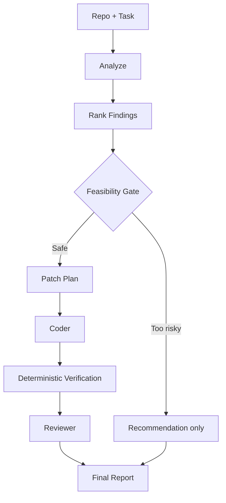

# Desk Code Agent — Product Requirements

> Version: `0.1.0-design`  
> Status: Implementation-ready specification  
> Canonical source: [`../DESK_CODE_AGENT_MASTER_DESIGN.md`](../DESK_CODE_AGENT_MASTER_DESIGN.md)

## 文件用途

定義產品定位、使用者、輸入輸出、任務模式、可行性閘門與第一版能力邊界。

---

# Part I — Product Definition

## 1. 產品定位

### 1.1 一句話定位

**Desk Code Agent 是一個完全地端的 AI Engineering Workspace，能在單張消費級 GPU 上理解、診斷、修改並驗證真實程式碼 Repository。**

### 1.2 不是什麼

本產品不是：

- 另一個只有對話框的 coding chatbot。
- 把整份 Repository 一次塞進 context 的長上下文展示。
- 宣稱 4B 模型可以無限制重構大型 monorepo 的 autonomous developer。
- 讓十幾個 Agent 無限互相聊天的 agent soup。
- 允許模型直接執行任意 shell、直接 push 到 main 或刪除使用者檔案的系統。

### 1.3 核心差異化

1. **Local-first privacy**：Repository、Prompt、Patch、Tests 與模型推論預設不離開本機。
2. **Evidence-first**：每個分析結果都要指出來源檔案、symbol、test 或工具輸出。
3. **Verification-first**：模型提出，機器驗證；不以「看起來正確」作為完成條件。
4. **Bounded autonomy**：使用者可以自由下達任務，但系統內部有 scope、risk 與 retry budget。
5. **Observable automation**：使用者可在動畫化 Agent Flow 中看見目前狀態、工具、證據、Patch 與測試。
6. **Single model, logical multi-agent**：只載入一份 Qwen3.5-4B，由不同 prompt、context、tools、memory 與 permission 形成多個角色。
7. **Skill 必須證明有效**：任何 Skill 都不能只因為名稱好聽就進入 production；必須通過 paired evaluation。

---

## 2. 目標使用者

### 2.1 主要使用者

- 個人開發者與研究生。
- 需要快速理解陌生 Repository 的工程師。
- 希望程式碼完全留在本機的使用者。
- 擁有 NVIDIA 消費級 GPU、希望離線運行 AI coding workflow 的使用者。
- 想分析、修復、測試與 review 中小型 Python／TypeScript／C／C++ 專案的人。

### 2.2 次要使用者

- 面試作品展示者。
- AI systems／agent engineering 研究者。
- 想比較 single-agent、multi-agent、skill、retrieval 與 quantization 的實驗者。

---

## 3. 輸入與輸出

### 3.1 支援輸入

| Input Type | 範例 | MVP | 完整版 |
|---|---|---:|---:|
| Local Folder | `D:\projects\my-app` | ✓ | ✓ |
| Git Repository URL | `https://github.com/org/repo` | ✓ | ✓ |
| GitHub Issue URL | `/issues/42` |  | ✓ |
| GitHub PR URL | `/pull/27` |  | ✓ |
| Zip／Archive | local source archive |  | ✓ |
| Free-form task | 「修掉 failing test」 | ✓ | ✓ |

### 3.2 支援輸出

- Repository Overview。
- Architecture／Dependency／Execution Flow 報告。
- Onboarding guide 與 recommended reading order。
- Technical debt、testing gap、security、performance findings。
- Patch plan 與 unified diff。
- Targeted tests、related tests、full test suite 結果。
- Reviewer decision 與 regression risk。
- Markdown／JSON／HTML report。
- `.patch` 檔、isolated branch、可選 Git commit。
- 完整 execution trace、tool calls、latency、tokens、VRAM 與失敗分類。

---

## 4. 任務模式

系統接收自由文字，但會分類為以下 mode：

| Mode | 典型任務 | 是否改碼 |
|---|---|---:|
| `EXPLORE` | 解釋某個 symbol／module | 否 |
| `ANALYZE` | 產生架構、品質、測試、風險報告 | 否 |
| `ONBOARD` | 帶新工程師理解 Repo | 否 |
| `DEBUG` | 分析 failing test／stack trace | 可選 |
| `CODE` | 小功能、bug fix、validation | 是 |
| `TEST` | 新增、修復、補足測試 | 是 |
| `REVIEW` | Review repo／commit／PR | 否 |
| `REFACTOR` | 局部 refactor | 是 |
| `DOCUMENT` | README、API、architecture docs | 可選 |
| `MIXED` | 分析問題，安全能修的直接修 | 部分 |

### 4.1 最重要的 Mixed Mode

使用者：

> 幫我分析這個 repo，找出最嚴重的五個問題，可以安全修的直接修。

系統：

---

## 5. 任務邊界與 Feasibility Gate

### 5.1 使用者輸入可以自由，內部執行不能無限制

每個任務在進入 editing 前都必須經過 feasibility gate。

### 5.2 預設 Task Budget

| Budget | L1 Local | L2 Multi-file | L3 Bounded cross-module |
|---|---:|---:|---:|
| Relevant files | 1–3 | 2–8 | 5–12 |
| Modified files | ≤2 | ≤5 | ≤8，需批准 |
| Patch lines | ≤120 | ≤400 | ≤800，需批准 |
| Search rounds | 3 | 5 | 7 |
| Patch attempts | 2 | 3 | 4 |
| Review rounds | 1 | 2 | 2 |
| Normal context cap | 8K | 12K | 16K |
| Network | off | off | approval only |

### 5.3 Feasibility 結果

- `AUTO_EXECUTE`：scope 小、測試可用、risk 低。
- `EXECUTE_IN_WORKTREE_AND_REQUEST_APPROVAL`：可以嘗試，但 commit／apply 需使用者確認。
- `REPORT_ONLY`：可以分析，不自動修改。
- `TASK_TOO_LARGE`：建議拆成子任務。
- `BLOCKED_BY_MISSING_ORACLE`：沒有可判定成功的測試或 acceptance criteria。
- `BLOCKED_BY_SECURITY_POLICY`：涉及 secrets、破壞性指令或越權操作。

### 5.4 第一版適合處理

- Failing unit test。
- Syntax／compile／type error。
- 單點 parser、config、serialization、validation bug。
- 小 feature。
- 1–5 檔案 localized refactor。
- 新增 unit tests。
- PR diff review。
- Repo overview／onboarding／technical report。

### 5.5 第一版不承諾自動完成

- 20–50+ 檔案 migration。
- 整個 framework 替換。
- 大型 distributed architecture redesign。
- 無測試、需求模糊的大規模重構。
- 任意 monorepo 全自主開發。

對這些任務，產品可以產生分析與 proposal，但 editing 預設鎖定為 `REPORT_ONLY`。

---
