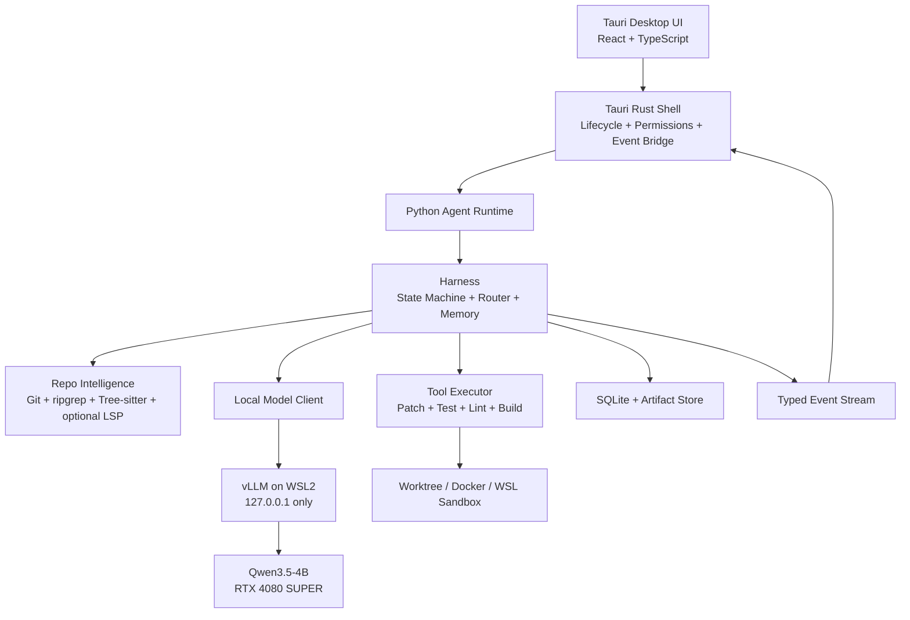
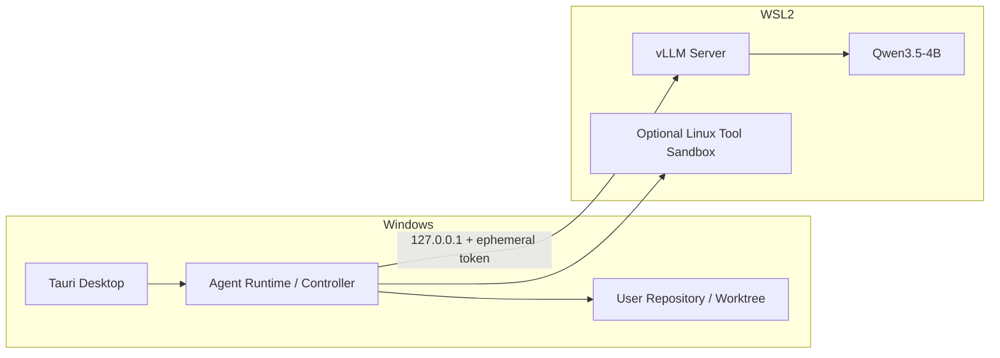
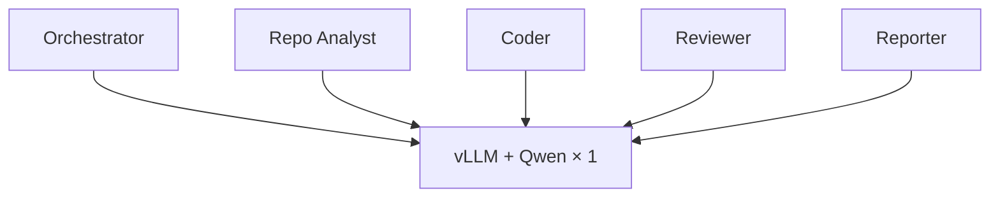

# Desk Code Agent — System Architecture

> Version: `0.1.0-design`  
> Status: Implementation-ready specification  
> Canonical source: [`../DESK_CODE_AGENT_MASTER_DESIGN.md`](../DESK_CODE_AGENT_MASTER_DESIGN.md)

## 文件用途

定義 Windows/Tauri/WSL2/vLLM/Qwen 的地端部署拓樸、模型後端抽象、模型配置與 context policy。

---

# Part II — System Architecture

## 6. 整體架構



### 6.1 分層責任

| Layer | 責任 | 不負責 |
|---|---|---|
| Desktop UI | 呈現、互動、動畫、審批 | Agent reasoning |
| Tauri Shell | process lifecycle、filesystem permission、secure IPC | Repo analysis |
| Agent Runtime | routing、state、agents、skills、memory | CUDA kernels |
| Repo Intelligence | index、symbol、graph、retrieval | 最終語意判斷 |
| Tool Executor | deterministic execution | 自行決策 |
| vLLM | 模型載入、streaming、KV cache、serving | Agent workflow |
| Qwen3.5-4B | 語言理解、局部 reasoning、patch、review | 真正執行工具 |

---

## 7. Windows 本機部署拓樸

vLLM 官方不原生支援 Windows，因此 Windows 版本採 WSL2 Linux backend；Tauri UI 仍是原生 Windows 桌面程式。



### 7.1 本機通訊安全

- vLLM bind：`127.0.0.1`，不可使用 `0.0.0.0` 作為產品預設。
- 每次啟動產生 ephemeral API key。
- Tauri 啟動與關閉 vLLM／agent sidecar，避免 orphan process。
- Prompt、repo content、tokens 不寫入一般 application log。
- Telemetry 預設只存 aggregate metrics。
- Cloud API 預設 `OFF`，必須由使用者明確啟用。

### 7.2 Backend abstraction

Agent Runtime 只依賴 OpenAI-compatible interface，未來可替換：

- vLLM + Qwen3.5-4B。
- llama.cpp + GGUF。
- SGLang。
- 使用者自訂 local endpoint。
- 可選 cloud model，但不屬於預設 privacy path。

---

## 8. Model 與 vLLM 設計

### 8.1 為何使用 vLLM

vLLM 是 inference／serving runtime，不是模型，也不是 Multi-Agent framework。它負責：

- 模型只載入一次。
- OpenAI-compatible local API。
- Streaming。
- PagedAttention／KV cache 管理。
- Continuous batching、prefix caching、chunked prefill。
- Structured output 與 tool-call parser。

所有 logical agents 都呼叫同一個 model server：



### 8.2 預設 Model Profiles

#### Quality Profile

- DType：BF16。
- Context：8K default，16K hard normal cap。
- Concurrent generation：1。
- Coder 可開啟 thinking；router／reporter 關閉或縮短。
- 作為所有功能與 quantization 的品質基準。

#### Balanced Profile

- FP8／INT8，僅在實測通過後啟用。
- Context：8K–16K。
- 目標：維持接近 BF16 的 task success，降低 peak VRAM。

#### Compact Profile

- 4-bit AWQ／GPTQ 或經驗證的量化版本。
- 不預設宣稱「幾乎無損」。
- 必須通過 coding／tool calling／review paired benchmark 才能成為可選 profile。

### 8.3 4-bit Admission Gate

4-bit 只有同時滿足以下條件才可標示為 `Validated`：

1. 同一 task suite、同一 harness、同一 seed policy 與 BF16 配對測試。
2. Overall task success drop ≤ 2 percentage points。
3. 任一 critical category drop 不得 > 5 points。
4. Tool-call schema validity 與 BF16 差距 ≤ 1 point。
5. Wrong-file edit rate 不增加超過 1 point。
6. Peak VRAM 至少下降 25%。
7. p95 end-to-end latency 不得惡化超過 10%，除非 VRAM profile 的目的明確。

若不通過，產品預設使用 BF16；Compact profile 標示為 experimental。

### 8.4 Role-specific inference policy

| Role | Thinking | Max output | Context strategy |
|---|---|---:|---|
| Router | Off | 150 tokens | task contract only |
| Orchestrator | Short | 300 | state summary |
| Repo Analyst | Short／medium | 800 | evidence bundle |
| Coder | Medium／On | 1,500 | code + tests + error |
| Reviewer | Short | 500 | contract + diff + verification |
| Reporter | Off／short | 1,200 | structured findings only |

### 8.5 Context 不是一直累積

每個 Agent 必須重新 retrieve 所需 evidence，而不是繼續 append 全部對話：

```text
Manager: 2–4K
Coder:   4–8K
Reviewer:2–4K
Reporter:3–6K
```

優先重新檢索精準 symbol，而不是保留大量 stale conversation history。

---
