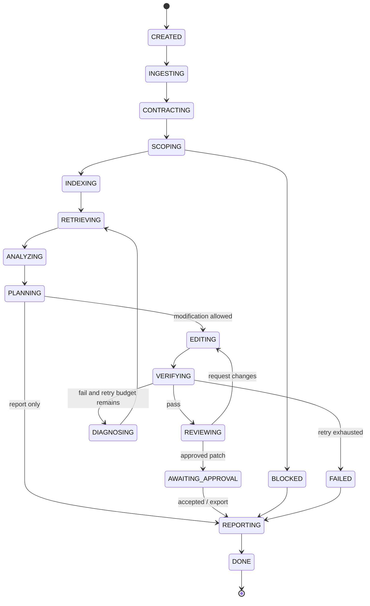

# Desk Code Agent — Multi-Agent Harness

> Version: `0.1.0-design`  
> Status: Implementation-ready specification  
> Canonical source: [`../DESK_CODE_AGENT_MASTER_DESIGN.md`](../DESK_CODE_AGENT_MASTER_DESIGN.md)

## 文件用途

定義 logical multi-agent、狀態機、retry/recovery、memory 與 deterministic runtime 的責任邊界。

---

# Part III — Multi-Agent Harness

## 9. Agent 定義

一個 Agent 不是一份獨立模型，而是：

\[
\text{Agent}=\text{Shared LLM}+\text{Role}+\text{Tools}+\text{Context}+\text{State}+\text{Permissions}
\]

### 9.1 Logical Agents

#### Orchestrator Agent

- 建立 task contract。
- 決定 mode、risk 與下一個 skill。
- 維護 state machine。
- 不直接 edit source code。
- 不執行 arbitrary shell。

#### Repo Analyst Agent

- 對 Repository 做 read-only reasoning。
- 執行 architecture、quality、testing、risk、performance、onboarding skills。
- 所有 finding 必須附 evidence references。

#### Coder Agent

- 只在 isolated worktree 操作。
- 接收 bounded patch plan 與 relevant context。
- 只能透過 `apply_patch` 等 constrained tools 修改。
- 不可 push GitHub。

#### Reviewer Agent

- 只看 task contract、diff、test result 與 surrounding code。
- 不直接修改 code，避免 reviewer 與 coder role collapse。
- 輸出 `APPROVE / REQUEST_CHANGES / BLOCK`。

#### Reporter Agent

- 將結構化 findings、trace 與 verification 組成可閱讀報告。
- 不新增未被 evidence 支援的事實。

### 9.2 Tester 為何不是 LLM Agent

Tester 是 deterministic service：

- `pytest`
- `vitest`
- `playwright`
- `cmake`
- `ctest`
- `g++ / clang++`
- `ruff / mypy / eslint / tsc`

原則：

\[
\boxed{\text{LLM proposes; machine verifies.}}
\]

---

## 10. Harness 組成

```text
Harness
├── Task Contract
├── Task Router
├── Feasibility Gate
├── State Machine
├── Agent Profiles
├── Skill Registry
├── Repo Retrieval
├── Context Builder
├── Tool Permission Layer
├── Sandbox / Worktree
├── Verification Pipeline
├── Reviewer Loop
├── Retry / Recovery
├── Artifact Store
├── Event Bus
├── Telemetry
└── Termination Rules
```

### 10.1 核心設計原則

- LLM 處理模糊語意；系統處理確定性規則。
- 每一步 decision space 要小。
- 每一輪 retry 必須帶入新 evidence。
- Agent 不可自行發明新狀態或跳過 verification。
- 所有 external side effect 都由 policy engine 審核。

---

## 11. State Machine



### 11.1 禁止 transition

- `EDITING → DONE`
- `ANALYZING → PUSH_GITHUB`
- `VERIFYING_FAIL → APPROVED`
- `REVIEWER_REQUEST_CHANGES → DONE`

---

## 12. Retry 與 Recovery

錯誤做法：

```text
Fail → 重問同一個 prompt
```

正確做法：

```text
Attempt 1
→ test failure
→ extract stack trace
→ retrieve caller/test
→ update hypothesis
→ Attempt 2
```

每一輪形成：

\[
\text{Retry}_{t+1}=\text{Previous State}+\text{New Evidence}+\text{Changed Hypothesis}
\]

預設上限：

- Search rounds：3–7。
- Patch attempts：2–4。
- Review rounds：1–2。
- Tool timeout：依工具設定。
- 超過 budget：`REPORT_ONLY` 或 `FAILED_WITH_EVIDENCE`。

---

## 13. Memory 設計

### 13.1 Working Memory

只保存當前 task 必需狀態：

```json
{
  "task_id": "dca-20260808-001",
  "current_state": "VERIFYING",
  "hypotheses": [],
  "relevant_symbols": [],
  "files_read": [],
  "files_modified": [],
  "failed_tests": [],
  "attempt_count": 1
}
```

### 13.2 Artifact Memory

- `task_contract.json`
- `repo_manifest.json`
- `retrieval_trace.jsonl`
- `findings.json`
- `patch_plan.json`
- `changes.patch`
- `test_results.json`
- `review_result.json`
- `run_summary.json`
- `report.md`

### 13.3 Long-term Repository Knowledge

- Build／test commands。
- Entry points。
- Coding conventions。
- Module summaries。
- Known flaky tests。
- User-approved project facts。

長期記憶必須帶 `source`、`repo_commit` 與 `last_validated_at`，避免 stale knowledge。

---
