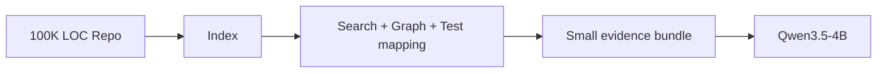

# Desk Code Agent — Repository Intelligence

> Version: `0.1.0-design`  
> Status: Implementation-ready specification  
> Canonical source: [`../DESK_CODE_AGENT_MASTER_DESIGN.md`](../DESK_CODE_AGENT_MASTER_DESIGN.md)

## 文件用途

定義 repository ingest、symbol/index、evidence retrieval、context builder 與 evidence traceability。

---

# Part IV — Repo Intelligence

## 14. Repository 不等於 Prompt

Repository 是外部 environment：



Qwen 不需要一次看到全部 Repository。

---

## 15. Repo Ingest Pipeline

1. 驗證來源與路徑。
2. Clone 或建立 local workspace reference。
3. 讀取 Git metadata、current commit、branch、dirty state。
4. 建立 isolated `git worktree`。
5. 偵測 languages 與 package manifests。
6. 建立 file tree 與 ignore rules。
7. 執行 secret pattern scan，遮蔽敏感內容。
8. 建立 lexical index。
9. 建立 Tree-sitter symbol index。
10. 建立 imports／references／test mapping。
11. 偵測 build／test commands，但不直接執行未批准 command。
12. 產生 `repo_manifest.json`。

---

## 16. 索引與搜尋

### 16.1 MVP

- `git ls-files`
- `.gitignore` aware file listing
- ripgrep text search
- filename／path ranking
- Tree-sitter definitions：function、class、method、import
- basic reference search
- test filename mapping

### 16.2 Beta

- Optional LSP definitions／references。
- call graph。
- package dependency graph。
- coverage-assisted source-test mapping。
- Git history／blame relevance。
- semantic embeddings，僅作補充，不取代 lexical／symbol retrieval。

### 16.3 Retrieval score

\[
S(f)=w_lS_{lexical}+w_sS_{symbol}+w_gS_{graph}+w_tS_{test}+w_eS_{error}+w_hS_{history}
\]

不同 task mode 使用不同權重。例如 failing test 任務提高 `test` 與 `error` 權重；architecture report 提高 `graph` 與 `entry point` 權重。

---

## 17. Context Builder

Coder evidence bundle：

```text
Task Contract
+ Focus symbol
+ Focus file range
+ Direct callers / callees
+ Relevant tests
+ Latest stack trace
+ Current diff
+ Repo conventions
```

Reviewer evidence bundle：

```text
Task Contract
+ Patch / diff
+ Changed symbol context
+ Targeted and full test results
+ Static checks
+ Risk flags
```

### 17.1 Context Quality Gates

- 不得把 binary、generated、vendor、build output 放入模型 context。
- 每個 code snippet 都要有 path、line range、commit hash。
- 重複內容去除。
- 對超長檔案以 symbol 切分，不用固定 token 亂切。
- 若 evidence 不足，Agent 必須要求 retrieval，而不是猜測。

---
